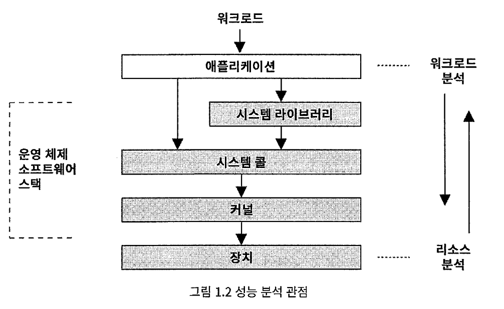
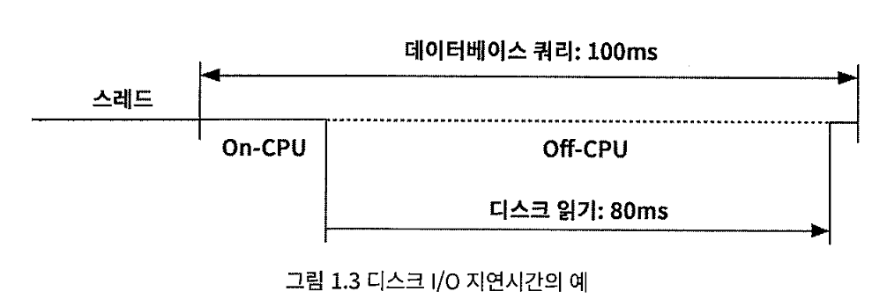
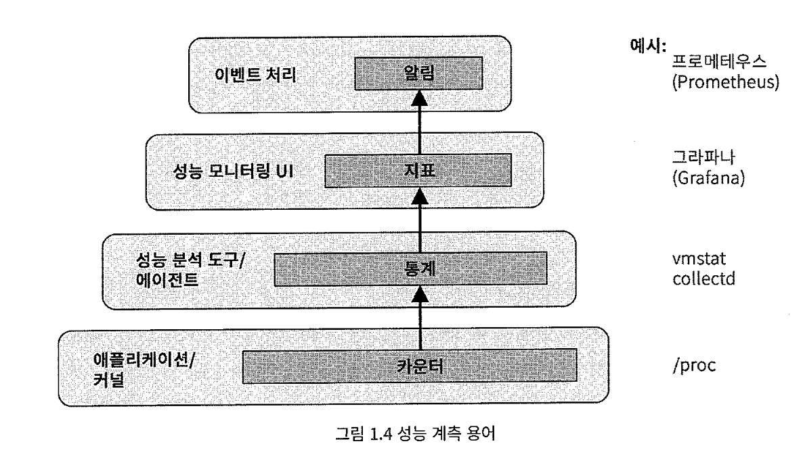

# 1장. 소개

1장에서 다루는 내용은 다음과 같다:
- 시스템 성능의 개념, 역할, 활동, 관점에 대해 이해하기
- 관측가능성 도구와 실험 도구의 차이점을 이해하기
- 성능 관측가능성 기초 개념 익히기: 통계, 프로파일링, 플레임 그래프, 트레이싱, 정적 계측 및 동적 계측
- 여러 방법론의 역할과 리눅스 60초 체크리스트에 대해 배우기

 

## 1.1 시스템의 성능

시스템 성능 분석은 소프트웨어와 하드웨어의 모든 핵심 구성 요소를 포괄하여 컴퓨터 시스템 전체의 성능을 연구하는 과정이다. 
데이터가 기자는 경로의 모든 요소, 저장 장치에서부터 애플리케이션 소프트웨어에 이르기까지 모든 것이 성능에 영향을 미칠 수 있고 성능 분석의 대상이다. 
시스템 성능 분석의 일반적인 목표는 지연 시간을 줄여 최종 사용자 경험을 개선하고, 컴퓨팅 비용을 절감하는 것이다. 비효율성을 제거하고 시스템 처리량을 향상시키며, 시스템 전반을 튜닝함으로써 비용을 절감할 수 있다. 
시스템 성능에 대해 얘기할 때 풀 스택은 애플리케이션부터 하드웨어에 이르기까지 시스템 라이브러리, 커널 및 하드웨어 자체까지 포함하는 전체 소프트웨어 스택을 의미한다.

 

## 1.2 역할

시스템 성능 관련 업무는 다양한 전문가들의 협력을 통해 이뤄지는 활동으로 시스템 관리자, 지원 팀, 애플리케이션 개발자, 네트워크 엔지니어, 데이터베이스 관리자, 웹 관리자, 기타 지원 인력 등이 포함된다. 
이들 중 대다수는 주로 자기 전문 분야의 성능 문제만 주목하기 때문에 성능 문제의 근본 원인이나 발생 요인을 파악하기 위해서는 여러 팀 간의 협력이 필수적이다. 
일부 회사는 performance engineer라는 직책을 두어 시스템 성능에 전문적으로 집중하게 한다.

 

## 1.3 활동

1. 향후 제품을 위한 성능 목표 및 성능 모델 설정하기
2. 프로토타입 소프트웨어나 하드웨어의 성능 특성 파악하기
3. 개발 중인 제품을 테스트 환경에서 성능 분석하기
4. 제품의 신규 버전에 대해 회귀 테스트 수행하기
5. 제품 출시 전 벤치마크 테스트 실시하기
6. 대상 환경에서의 개념 증명 테스트하기
7. 프로덕션 환경에서 성능 튜닝하기
8. 운영 중인 프로덕션 소프트웨어 모니터링하기
9. 프로덕션 성능 문세 발생 시 성능 분석 수행하기
10. 발생한 프로덕션 성능 문서에 대해 사후 분석 실시하기
11. 프로덕션 분석을 개선하기 위한 성능 분석 도구 개발하기

 

성능 엔지니어링은 하드웨어 선택이나 소프트웨어 작성 전부터 시작해야 하며, 첫 단계로 목표 설정과 성능 모델을 작성해야 한다. 
클라우드 컴퓨팅은 초기 단계(1-5)를 건너뛰고 바로 개념 증명 테스팅(POC)를 수행할 수 있도록 한다. 
그 중 하나인 **카나리 테스팅**은 신규 소프트웨어를 프로덕션 환경 선체가 아닌 일부분에만 적용해 테스트해보는 방식이다. 
또 다른 방법은 **블루-그린 배포**로, 두 개의 거의 동일한 프로덕션 환경을 준비해 하나는 현재 버전을 실행하고 다른 하나는 새 버전을 배포한 후, 트래픽을 점진적으로 새 환경으로 이동시키며 문제가 있는지 확인한다. 문제가 발생한 경우 쉽게 이전 환경으로 돌아갈 수 있다. 
수용량 계획은 앞어 언급한 여러 활동 중 일부를 포함하는 개념이다.

 

## 1.4 관점

 

성능 분석에는 워크로드(작업 부하) 분석과 리소스 분석의 두 가지 관점이 있다. 
리소스 분석은 시스템 자원을 관리하는 시스템 관리자들이 주로 사용하는 접근법이고, 워크로드 분석은 작업 부하의 성능을 책임지는 애플리케이션 개발자들이 주로 사용한다.

 

## 1.5 성능 분석의 어려움

- 주관성
    - 성능 문제가 존재하는지 여부를 명확히 알 수 없거나 문제가 있더라도 해결되었는지 불분명한 경우가 있음
    - 목표를 명확하게 설정함으로써 객관화할 수 있음
    - 목표 평균 응답 시간을 정하거나, 요청의 일정 비율이 특정 지연시간 이내에 처리되는 기준을 세우거나 하는 식
- 복잡성
    - 시스템 자체의 복잡성 및 분석을 어디서부터 시작할지 명확하지(명확한 원인이 없음)
    - 독립적으로는 잘 작동하는 서브시스템도 서브시스템 간 상호작용 때문에 성능 문제가 비롯될 수 있음 (캐스케이딩 실패)
    - 복잡한 성능 문제를 해결하기 위해서 전체 시스템을 조사하는 종합적인 접근법이 필요할 때도 있음
- 복합 원인
    - 일부 성능 문제는 하나의 근본 원인보다는 여러 요인이 복합적으로 작용하여 발생함
- 여러 성능 문제
    - 복잡한 소프트웨어는 보통 많은 성능 문제를 가지고 있음
    - 실제 과제는 성능상 문제를 찾는 게 아니라 어떤 문제들이 가장 심각한지 식별하는 것
    - 성능 분석가는 각 문제의 규모를 정량화할 수 있어야 하며, **성능 정량화**에 가장 적합한 지표 중 하나는 **지연 시간**임

 

## 1.6 지연 시간

지연시간은 기다리는 데 소요된 시간을 측정하는 것으로, 필수 성능 지표로 아주 널리 사용된다. 
넓은 의미에서 특정 작업이 완료되는 데 걸리는 시간을 의미하는데 애플리케이션 요청, 데이터베이스 쿼리, 파일 시스템 연산 등에 소요되는 시간을 말한다.

 

지연 시간은 최대 속도 향상을 추정할 수 있게 해주는 지표이기도 하다. 
위 그림의 디스크 I/O 지연시간을 살펴보면 100ms의 데이터베이스 쿼리 지연시간 중 80ms는 디스크 읽기를 기다리느라 대기하는 시간이다. 
따라서 디스크 읽기를 없애거나 캐싱을 통해 개선할 수 있다면 최대로 얻는 향상은 100ms에서 20ms로 5배의 속도 향상 추정치를 얻을 수 있다. 
다른 지표에서는 이런 계산이 불가능하다. 예를 들어 초당 I/O 작업 수(IOPS)는 I/O 유형에 따라 달라지므로 계산하기 어렵다. 
또한 연결을 수립하는데 걸리는 시간(연결 지연시간), 데이터 전송 시간을 포함한 전체 연결 지속 시간(요청 지연시간) 등 다양한 맥락을 포함할 수 있으므로 지연 시간이라는 단어만 사용한다면 구체적인 맥락을 정의하지 않아 모호할 수 있다. 
BPF 기반 관측가능성 도구를 이용하면 원하는 임의의 지점에서 지연시간을 측정할 수 있으며 지연시간의 전체 분포 데이터를 얻을 수 있다.

 

## 1.7 관측가능성

관측가능성이란 관찰을 통해 시스템을 이해하는 능력 및 이를 가능하게 하는 도구들을 말한다. 
카운터, 프로파일링, 트레이싱을 사용하는 도구들은 포함되고, 벤치마크 도구는 워르코드 실험을 통해 시스템 상태를 변화시키기 때문에 해당되지 않는다.

 

### 1.7.1 카운터, 통계, 지표

 

- 카운터: 애플리케이션과 커널의 작업 수행 횟수, 바이트 수, 지연시간 측정치, 자원 사용량, 오류 비율 등 본인의 상태와 활동에 관한 데이터를 저장하는 곳 
    - 예) `vmstat`: /proc 파일 시스템 내의 커널 카운터를 기반으로 가상 메모리 통계와 기타 시스템 정보 요약
- 지표: 대상을 평가하고 모니터링하기 위해 선정된 통계
    - 측정값을 바탕으로 사용자 정의 알림을 생성해, 문제가 감지되었을 때 담당자들에게 알림이 감
    - 문제 발생 시점 및 변경 사항과의 연관성을 파악하여 시계열 지표만으로도 성능 문제를 해결할 수 있음
    - 지표가 구체적인 원인을 설명하지 않을 때는 프로파일링이나 트레이싱 도구를 사용해 원인을 파악해야 함

 

### 1.7.2 프로파일링

프로파일링: 샘플링을 수행하는 도구의 사용, 일부 측정값을 샘플로 삼아 대상의 전반적인 상태를 대략적으로 파악하는 방식 
가장 흔한 프로파일링 대상은 CPU로, 정해진 시간 간격마다 CPU에서 실행되는 코드 경로를 샘플링하여 사용 패턴을 파악하는 방식으로 진행한다. 
플레임 그래프는 CPU 프로파일링 데이터 시각화 도구로, 사용 패턴을 통해 다양한 유형의 문제를 식별할 수 있다. 

 

### 1.7.3 트레이싱

트레이싱: 시스템 내에서 발생하는 이벤트들을 기록하고 추적하는 과정 
이렇게 수집된 이벤트 데이터는 저장되어 추후 분석에 활용되거나, 실시간으로 사용자가 원하는 요약 정보나 다른 처리를 위해 사용된다. 
트레이싱 도구로는 starce처럼 시스템 콜을 트레이싱하거나, tcpdump처럼 네트워크 패킷을 트레이싱하거나, bpftrace처럼 모든 소프트웨어 및 하드웨어 이벤트의 실행을 분석하는 범용 트레이싱 도구가 있다.

 

- 정적 계측: 소스 코드에 하드 코딩된 소프트웨어 계측점
    - 리눅스의 커널 정적 계측 기술은 tracepoint, 사용자 공간 소프트웨어의 정적 계측 기술은 USDT로 불림
    - 도구로는 execsnoop가 있는데, 시스템 콜을 추적하는 tracepoint를 계측하여 트레이싱을 하는 동안 생성된 새로운 프로세스들을 출력함
- 동적 계측: 소프트웨어가 실행 중에 계측점을 생성하는 방식, 메모리 내의 명령어를 수정하여 계측 루틴을 삽입함
    - 실행 중인 어떤 소프트웨어에서도 사용자 맞춤형 성능 통계를 생성함
    - 가장 유명한 도구로는 DTrace가 있음
- BPF: 커널 내에서 안전하고 빠르게 자원에 접근할 수 있는 범용 실행 환경
    - BCC와 bpftrace 프론트엔드를 사용해 프로그래밍 가능함

 

## 1.8 실험

예시로 벤치마킹 도구가 있으며, 실험 도구는 인공적인 워크로드를 시스템에 적용하고 성능을 측정하는 방식으로 실험을 수행한다. 
실험 도구가 테스트 중인 시스템의 성능을 교란시킬 수 있기 때문에 실험은 주의 깊게 이루어져야 한다. 
벤치마킹 도구는 크게 두 가지로 나뉜다. 
- 매크로 벤치마크 도구: 클라이언트가 애플리케이션 요청을 발생시키는 것과 같은 실제 환경의 작업 부하를 시뮬레이션
- 마이크로 벤치마크 도구: CPU, 디스크 등 특정 구성 요소를 개별적으로 테스트, 디버깅 및 결과 반복 확인이 용이함

프로덕션 시스템에서는 우선 관측 도구를 사용해 문제를 분석하는 것이 좋다.

 

## 1.9 클라우드 컴퓨팅

클라우드 컴퓨팅은 수요에 따라 컴퓨팅 자원을 배포하는 방식으로, 인스턴스라 불리는 소형 가상 시스템을 계속 늘려가며 애플리케이션을 배포할 수 있어 빠른 확장이 가능하다. 
하지만 클라우드를 사용하면 분당 또는 시간당 요금이 부과되는데, 성능 향상으로 더 적은 시스템을 사용할 수 있다면 비용 절감으로 이어지기 때문에 성능 분석의 필요를 넢인다. 
또한 다른 테넌트가 성능에 미치는 영향 관리(= 성능 관리) 및 각 테넌트가 다른 사용자의 물리적 시스템을 보지 못하도록 막는 작업이 필요하다.

 

## 1.10 방법론

방법론: 시스템 성능을 분석할 때 권장되는 단계를 문서화하는 방법
예를 들어, 60초 리눅스 성능 분석 체크리스트는 다음과 같다. 

| 단계 | 명령어 | 체크리스트 |
|------|--------|------------|
| 1 | `uptime` | 부하 증감 확인 |
| 2 | `dmesg -T l tail` | 커널 오류 |
| 3 | `vmstat -SM 1` | 시스템 전체에 대한 통계 |
| 4 | `mpstat -P ALL 1` | CPU별 부하 균형 |
| 5 | `pidstat 1` | 프로세스별 CPU 사용률 조사 |
| 6 | `iostat -sxz 1` | 디스크 I/O 통계 파악 |
| 7 | `free -m` | 메모리 사용률 체크 |
| 8 | `sar -n DEV 1` | 네트워크 장치 |
| 9 | `sar -n TCP,ETCP 1` | TCP 통계 분석 |
| 10 | `top` | 전체 개요 확인 |

 

## 11.1 사례 연구

### 1.11.1 느린 디스크

- 문제 상황: 데이터베이스 서버 중 한 대에 느린 디스크가 있음
- 상황 파악: 1000ms를 초과하는 쿼리 로그 발생, AcmcMon을 통해 디스크 사용률 확인
- 원인 파악: USE 방법론을 통해 자원 병목 지점 확인
    - 디스크 사용률은 지속적으로 증가했지만 CPU 사용률은 일정함
    - 높은 부하 상태에서 디스크가 정상적을 동작하고 있음을 확인함
    - 프로토타입 애플리케이션이 메모리를 많이 사용해 파일 시스템 캐시에 할당될 수 있는 메모리를 줄여, 캐시 히트율이 낮아져 I/O 증가
- 문제 해결: 프로토타입 애플리케이션을 다른 서버로 이동

 

### 1.11.2 소프트웨어 변경

- 상황: 새로 개발된 기능을 적용하기 전에 성능 확인을 위한 테스트 진행
- 테스트 진행 방식: 스트레스 테스트, 서버가 한계에 도달할 때까지 부하를 늘려감
    - 부하를 가한 상태에서 제약 요인을 파악하기 위해 능동적 벤치마크 수행
    - 서버 리소스뿐만 아니라 애플리케이션 로직을 확인함
    - 스테드 상태 분석을 통해 소프트웨어가 단일 스레드로 구성되어 있어 성능 제약이 발생하는 것을 파악함